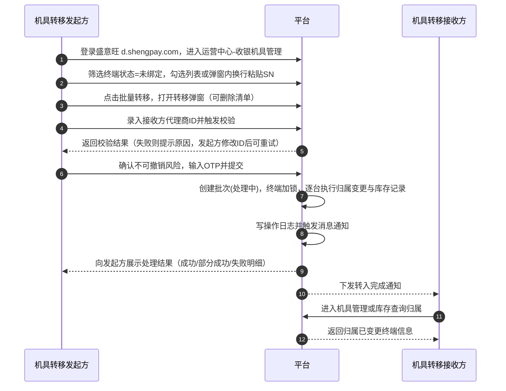
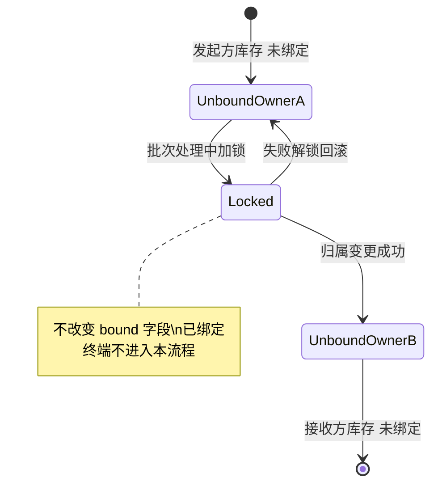
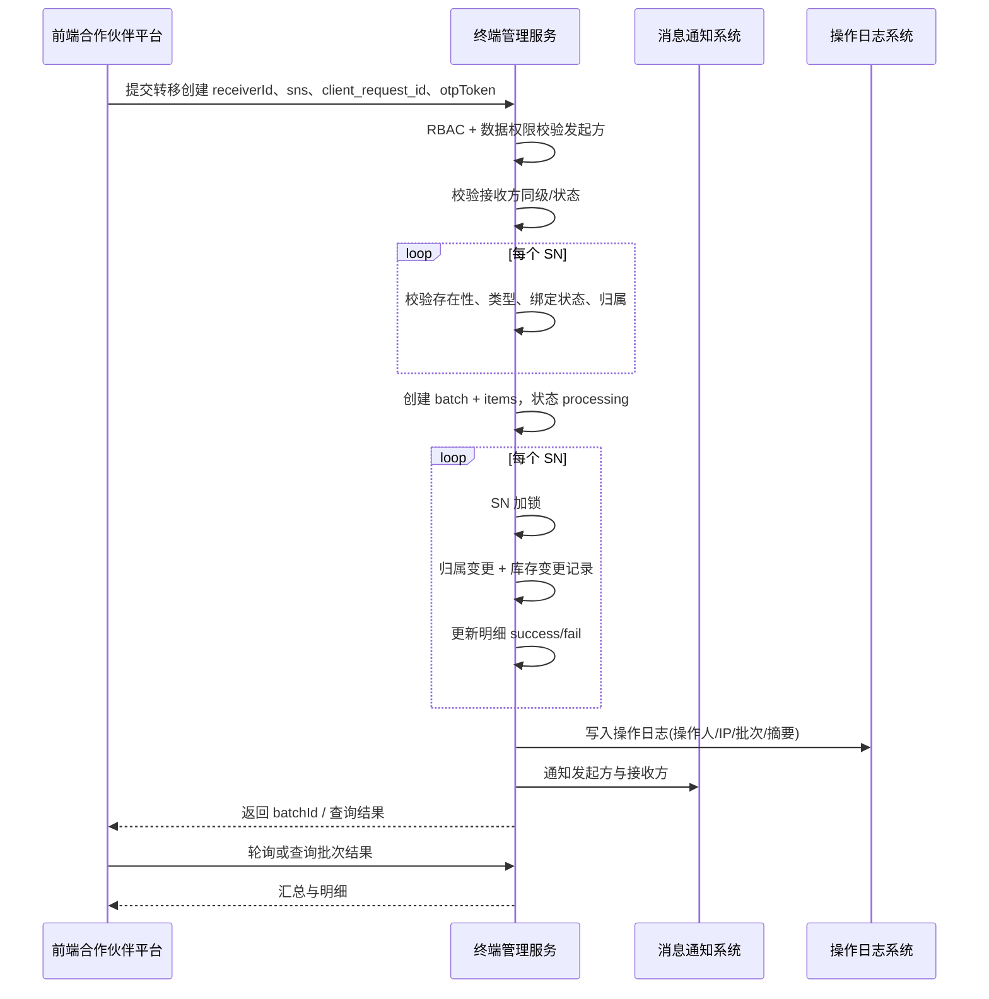

# 代理商机具转移（平级服务商设备转移）PRD

> 角色：盛付通（盛意旺合作伙伴平台）资深支付产品经理  
> 平台：盛意旺合作伙伴平台（`d.shengpay.com`）  
> 关联存量能力：收银机具管理、换绑、批量划拨/收回（仅代理商）

---

## 模块一：需求分析

本模块目标：把“为什么要做、做了带来什么、必须守住哪些边界、有哪些风险”一次性说清楚，为后续流程/交互/系统设计定下不可更改的业务基线。

### 1. 真实业务场景还原

以下场景均指**代理商（服务商）之间平级转移终端**，接收方仅限同级代理商，不涉及渠道商/商户层级。

| 序号 | 场景名称 | 场景说明 | 紧迫程度 | 频率估计 |
|:---:|:---|:---|:---|:---|
| 1 | 代理商团队/主体变更（离职/交割） | 原服务商团队退出区域经营，将库存终端（未绑定）整体交割给接手服务商 | 高 | 中（区域/团队季度级变化） |
| 2 | 区域重组与经营权转移 | 总部调整区域划分，A 服务商负责的城市划转给 B 服务商，需转移区域库存与待投放终端 | 高 | 低-中（半年/年度） |
| 3 | 业务转让（存量商户资产打包转让） | A 服务商将某行业/连锁客户的经营权转给 B 服务商，涉及一批门店待部署设备从 A 库存转给 B | 中-高 | 中（按行业与区域） |
| 4 | 库存互借（短期供给不足/紧急投放） | B 服务商短期需求激增但采购到货慢，A 服务商临时转移一批未绑定终端支援投放 | 中 | 高（旺季/活动期更高） |
| 5 | 跨服务商协作项目（联合拓展） | 联合拓展某大型活动/展会，设备由项目牵头服务商统一采购后再分配给合作服务商投放 | 中 | 中 |
| 6 | 历史资产纠偏（归属登记错误/串货处置） | 设备实际由 B 采购但误登记在 A 名下，需按审计结果做归属修正转移 | 中-高 | 低（单次量可能大） |
| 7 | 服务商合并/拆分 | 集团化服务商内部主体调整，设备归属需从旧主体迁移至新主体 | 高 | 低 |

### 2. 用户痛点与平台价值

**代理商（服务商）视角**
- **痛点1：转移靠人工**：目前平级转移缺乏平台入口，只能客服/运营介入或走线下登记，耗时 1-3 个工作日。
  - **价值量化**：将处理时长从“天级”压缩到“分钟级”，设备投放延迟降低 ≥80%。
- **痛点2：缺乏可追溯**：转移缺少标准化留痕与双方确认，容易出现“转了多少、是否到帐”的争议。
  - **价值量化**：设备归属争议工单减少 ≥50%。
- **痛点3：风险不可控**：涉及已绑定设备时，现状要么绕过系统，要么误用换绑/划拨造成异常解绑。
  - **价值量化**：已绑定设备误操作导致的交易中断/投诉减少 ≥30%。

**盛付通平台视角**
- **价值1：降低运营成本**：将“平级转移”从人工流程沉淀为可控能力。
  - **量化**：相关客服/运营工单介入量减少 40%-60%。
- **价值2：提升资产治理**：统一审计日志与风控策略，避免设备资产私下流转。
  - **量化**：异常转移/串货识别命中率提升，审计取证时间降低 ≥70%。
- **价值3：提升机具周转效率**：库存可在服务商间动态调度，减少闲置与重复采购。
  - **量化**：平均库存周转天数下降 10%-20%，采购峰值压力下降。

### 3. 核心边界条件与业务规则（重点输出）

#### 3.1 机具绑定状态白名单（明确处理建议）
- **未绑定（归属服务商库存中）**：**允许转移**。
  - **理由**：不影响商户/门店经营，不涉及交易中断，风险可控。
- **已绑定（已绑定商户/门店）**：**禁止直接转移**，必须先完成解绑后再转移。
  - **理由**：平级服务商变更设备归属，会引发存量商户服务关系、终端管理责任归属与潜在纠纷；自动解绑会直接影响收款与现场设备可用性，属于高风险不可逆操作。
  - **与存量能力一致性**：存量“划拨/收回”在代理商→渠道商场景可自动解绑，但平级服务商之间不具备同一管理链路，风险级别更高，必须抬高门槛。

#### 3.2 终端类型范围（参照现有划拨规则并扩展建议）
- **支持转移**：与“批量划拨/收回”可流转的实体/库存类终端对齐，并**明确包含智能POS**（平级服务商间资产调拨需求与智能POS保有量匹配，由系统按 SN 校验归属与绑定状态）。
  - **智能POS**
  - 收款码牌（实体码牌）
  - 云音箱、音箱码牌一体机
  - 联迪扫码王
  - 支付宝碰一下终端
  - 云打印机
  - 扫码盒子（N7）
- **不支持转移**
  - **电子码牌、银联前置码牌、虚拟 code**：不支持（与换绑能力限制一致，避免虚拟标识跨主体流转歧义）。

#### 3.3 数量与频次限制
- **单次批量上限**：≤ 500 台（与性能与非功能需求一致）。
- **不设置**：每日发起次数上限、同一账号/主体日频次上限、同一 SN 冷却期；由业务方按需发起，系统仅保留单次批量上限与并发锁、幂等等技术约束。
- **失败重试限制**：同一批次失败项可在 24 小时内发起一次重试，超过需重新创建新批次并重新校验接收方。

#### 3.4 接收方资质校验（明确判断逻辑）
- **同级代理商判断**：
  - 发起方与接收方均为“代理商（服务商）主体”
  - 且二者归属相同“上级平台/合同体系”（系统字段以 `parent_agent_id` 或同等字段为准；若无则以“代理商类型=服务商”且不属于渠道商层级为判定）
- **账号状态校验**：
  - 接收方服务商账号必须为：正常、未冻结、未注销
  - 风控标记：若接收方命中“高风险/限制交易/限制资产操作”标签，则禁止作为接收方
- **信息回显校验**：输入接收方服务商ID后，必须回显服务商名称、主体信息（如企业简称/证照摘要字段）供二次确认。

#### 3.5 不可逆操作保护设计
- **强二次确认**：转移确认弹窗必须包含：
  - 接收方服务商ID + 名称回显
  - 转移数量
  - 风险提示：“归属变更不可撤销，平台不支持回退”
- **操作人校验**：发起方提交必须完成短信/OTP 二次鉴权，用于高风险资产操作。
- **批次锁定**：提交后生成批次号，批次进入“处理中”后不可修改接收方、不可新增/删除 SN。

### 4. 合规与风控风险清单

| 风险点 | 描述 | 初步应对策略 |
|---|---|---|
| 1. 绕过监管私自转移资产 | 服务商将设备私下转移规避管理 | 接收方同级校验 + 风控标签拦截 + 审计留痕 + 高频/大额预警 |
| 2. 恶意批量转移 | 内部账号被盗后将库存大量转走 | 二次鉴权（OTP）+ 单次批量上限 + 异常地理/IP 风控 |
| 3. 已绑定设备被错误转移 | 影响商户收款，造成投诉/损失 | 已绑定直接拦截 + 明确提示“先解绑后转移” |
| 4. 串货/归属纠纷 | 设备来源不清导致归属争议 | 转移需要双方可查记录；通知与审计留痕 |
| 5. 重复/并发操作导致库存错乱 | 同一 SN 被多个批次处理 | 终端级锁（SN 锁）+ 幂等键（batch_id + sn） |
| 6. 规避采购/奖励规则（间接） | 通过转移影响激励判定 | 本需求声明不涉及分润/激励，但审计记录提供后续核查依据 |
| 7. 接收方主体异常/被处罚 | 资产转入受限主体 | 接收方状态/风控标签校验，命中即拒绝 |

---

## 模块二：竞品分析

本模块目标：用行业常见做法校准“是否需要接收确认、是否允许已绑定、是否要审核”，并提炼适合盛付通现有“划拨/收回”交互风格的差异化机会点。

> 说明：若公开资料不足，以下以行业通用逻辑进行**推断**并标注。

| 维度 | 拉卡拉 | 嘉联支付 | 微信/支付宝 |
|------|--------|----------|-------------|
| 是否支持平级转移 | **推断：支持**（调拨/转移能力常见） | **推断：支持**（服务商/代理体系常见） | **推断：部分支持**（更偏设备绑定管理，平级流转受限） |
| 发起方式 | 列表勾选 + 调拨到目标服务商 | 列表勾选/导入 SN + 转移 | 设备管理员在服务商后台做设备分配/回收（可能更强审核） |
| 接收方确认机制 | **推断：可选或强制确认** | **推断：强制确认**（避免纠纷） | **推断：平台审核为主**，或受限于平台规则 |
| 允许转移的终端状态 | 多为未绑定/未激活 | 多为未绑定 | 多为未绑定；已绑定通常不允许 |
| 批量操作支持 | 支持 | 支持 | 支持但限制更强（导入/批量） |
| 审核流程 | **推断：大额/高频触发审核** | **推断：部分场景审核** | **推断：平台审核/风控拦截更强** |
| 操作留痕/审计 | 有日志与批次 | 有批次记录 | 完整审计（平台级） |

**值得借鉴的设计（≥3条）**
- **强制接收方确认**：平级资产流转最易产生纠纷，确认机制可显著降低争议。
- **批次化与明细可追踪**：批次号 + 明细 SN 成功/失败原因，方便双方对账。
- **导入与粘贴并存**：除勾选外提供 SN 批量粘贴/导入，提升效率。

**需要避免的设计陷阱（≥3条）**
- **允许已绑定自动解绑**：会造成商户经营中断且责任难界定，风险不可接受。
- **缺少二次鉴权**：资产操作易被盗号利用，产生大额损失。
- **缺少批次与明细审计**：平级转移易产生纠纷，必须可追溯、可对账。

**盛付通的差异化设计机会**
- **复用“批量划拨/收回”交互范式**：在“收银机具管理”中新增“批量转移”入口，沿用勾选/确认清单/可删除明细逻辑，降低学习成本。
- **平台风控联动**：把“转移”纳入资产高风险操作体系（OTP、限额、异常拦截），并提供运营可介入的审核/冻结能力。
- **双向记录可查**：新增“转移记录”列表，发起方/接收方均可查询，且下级渠道商不可见，减少争议。

---

## 模块三：业务流程设计

本模块目标：明确“用户怎么做、系统怎么响应、异常怎么处理、状态怎么流转”，让研发能按流程逐点实现并可测试验证。

### 1. 主流程（Happy Path）

以下主流程采用 **Mermaid `sequenceDiagram`**，参与者为 **机具转移发起方**、**平台**、**机具转移接收方**。**本期不做接收方预确认**：发起方完成校验与 OTP 提交后，平台**直接执行**归属变更，再通知双方。

**文字摘要（与上图对应）**  
- **机具转移发起方**：登录 → 进入收银机具管理 → 筛选未绑定 → 勾选或粘贴 SN → 批量转移 → 录入接收方 ID（校验失败可修改后重试）→ OTP 提交 → 查看结果与转移记录。  
- **平台**：承接交互与校验 → 建批次、加锁、逐台处理与归属变更 → 操作日志与通知 → 向发起方展示结果。  
- **机具转移接收方**：转移完成后接收通知 → 在机具管理或库存中查看归属已变更终端（**无需在转移前于平台侧确认**）。

### 2. 异常流程（至少8种异常场景）

| 异常场景 | 触发条件 | 系统处理方式 | 用户提示文案建议 |
|---|---|---|---|
| 1. 接收方ID不存在 | 输入的服务商ID无匹配主体 | 阻断提交 | “未找到该代理商ID，请核对后重试” |
| 2. 接收方非同级代理商 | 接收方为渠道商或非同级主体 | 阻断提交 | “仅支持同级代理商之间转移，当前接收方不符合条件” |
| 3. 接收方账号异常 | 冻结/注销/风控限制资产操作 | 阻断提交 | “接收方账号状态异常，禁止接收转移” |
| 4. 选中终端包含已绑定 | SN 状态=已绑定 | 阻断该 SN；若批量则部分失败 | “SN {xxx} 为已绑定状态，需先解绑后再转移” |
| 5. 终端类型不支持 | 电子码牌/银联前置码牌/虚拟 code 等 | 阻断该 SN；批量部分失败 | “SN {xxx} 终端类型不支持转移” |
| 6. 终端不归属当前服务商 | 归属字段不等于发起方 | 阻断该 SN | “SN {xxx} 不在当前代理商库存中，无法转移” |
| 7. 并发锁冲突 | SN 已被其他批次锁定 | 阻断该 SN | “SN {xxx} 正在处理中，请稍后再试” |
| 8. 二次鉴权失败 | OTP 错误/超时 | 阻断提交 | “验证失败，请重新获取验证码并提交” |
| 9. 系统执行失败 | 归属变更或写库失败 | 批次标记部分失败并可重试失败项 | “系统繁忙，部分终端转移失败，可在记录中重试失败项” |

### 3. 已绑定终端的特殊处理流程（两方案对比）

**方案A：禁止转移已绑定终端（转移前必须手动解绑）**
- 优点：
  - 风险最低，不会中断商户收款与现场设备可用性
  - 责任边界清晰：解绑是业务方主动行为，可由服务商与商户协商
  - 与“换绑/解绑”存量路径一致，便于培训与审计
- 缺点：
  - 增加操作步骤，转移效率降低
  - 需要额外引导用户去完成解绑

**方案B：转移时自动解绑（参考划拨/收回自动解绑逻辑）**
- 优点：
  - 转移效率高，一步完成
- 缺点：
  - 高风险不可逆：商户可能立即无法使用该终端收款
  - 平级服务商间责任难界定，投诉与纠纷成本高
  - 易被滥用：通过“转移”实现恶意解绑/抢占客户

**推荐方案：方案A（禁止已绑定直接转移）**
- 理由：平级服务商之间不具备层级管理关系，自动解绑的风险与纠纷成本显著高于效率收益；本功能定位为“库存资产平级调拨”，必须严格限定为“未绑定”。

### 4. 终端状态流转描述

**原归属方视角**
- 转移前：终端状态=未绑定，归属=发起方服务商
- 转移中：终端进入“锁定”状态（仅操作锁，不改变终端绑定状态字段）
- 转移完成后：终端状态仍=未绑定，归属=接收方服务商（归属渠道商字段同步变化或清空按规则）

**接收方视角**
- 转移请求到达：收到“转入完成通知”（**完成后通知**）
- 归属变更完成：终端进入接收方库存，可在库存查询与机具列表中看到

---

## 模块四：系统流程设计

本模块目标：把前端到后端各系统的调用顺序、关键字段变更、事务一致性与并发控制说清楚，保证实现可落地且数据不乱。

### 1. 系统交互时序（流程图）

**步骤摘要**：前端提交 → 终端管理服务鉴权与接收方校验 → 逐 SN 基础校验 → 创建批次与明细、加锁 → 执行归属变更与库存记录 → 更新明细与批次汇总 → **写入操作日志** → 通知 → 前端查询结果。（**说明**：本期时序图不体现独立**风控系统**调用；如需风控可在后续版本增加与 TM 的交互。）

### 2. 关键数据状态变更清单

| 系统/模块 | 数据对象 | 字段名 | 变更前值 | 变更后值 | 变更时机 |
|---|---|---|---|---|---|
| 终端管理服务 | 终端主数据 | owner_agent_id（所属代理商） | 发起方ID | 接收方ID | 单台执行成功时 |
| 终端管理服务 | 终端主数据 | channel_owner_id（归属渠道商） | 可能为某渠道商ID/空 | 按归属规则更新（见 BR） | 单台执行成功时 |
| 终端管理服务 | 终端操作锁 | locked_by_batch_id | 空 | 批次号 | 批次处理中 |
| 终端管理服务 | 终端操作锁 | lock_expire_at | 空 | 当前时间+TTL | 加锁时 |
| 终端管理服务 | 绑定信息 | bound_merchant_id / bound_store_id | 必须为空（未绑定） | 保持为空 | 全流程 |
| 操作日志系统 | 操作记录 | action | 无 | device_transfer | 批次创建与完成 |
| 消息系统 | 通知记录 | template_code | 无 | DEVICE_TRANSFER_RESULT | 批次完成后 |

### 3. 事务一致性设计

- **一致性目标**：终端归属变更、批次/明细状态、库存变更记录三者必须一致；操作日志与通知允许最终一致，但需可追溯补偿。
- **策略**：
  - 核心写操作（批次、明细、终端归属、库存记录）在同一数据库事务中按“单台”为单位提交，避免批量大事务锁表。
  - 操作日志、通知采用 Outbox 模式：
    - 先在同库写入 outbox 事件（与单台事务同提交）
    - 异步投递到操作日志/通知系统
  - **失败回滚**：
    - 单台执行失败不影响其他明细，批次汇总为部分成功
    - outbox 投递失败可重试，不影响已完成的归属变更

### 4. 并发控制

- **终端级锁**：以 SN 为键加分布式锁/数据库乐观锁字段，保证同一 SN 同一时刻仅允许一个批次处理。
- **幂等控制**：使用 `client_request_id` + 发起方ID 作为幂等键，避免重复提交生成多个批次。
- **锁超时释放**：锁 TTL 建议 10 分钟，后台任务定期清理超时锁并将明细标记为失败（原因=超时），支持用户重试。

---

## 模块五：用户交互设计

本模块目标：在不改变用户习惯的前提下，把“批量划拨/收回”的成熟交互范式复用到“批量转移”，并通过回显、校验、强提示与结果明细把误操作与争议降到最低。

### 1. 操作路径设计

**单台转移（精确到点击）**
1. 进入 **运营中心 → 收银机具管理**。
2. 在列表中找到目标终端（状态=未绑定）。
3. 勾选该行（或点击行操作“更多”）。
4. 点击顶部/行内操作 **批量转移**（单台也复用同入口）。
5. 弹窗输入接收方代理商ID → 触发校验与信息回显。
6. 点击“确认转移” → 弹出二次确认框。
7. 完成 OTP 校验 → 提交。
8. 跳转结果页展示成功/失败及批次号。

**批量转移**
1. 列表筛选“未绑定”，勾选多条终端。
2. 点击顶部操作 **批量转移**。
3. 在“确认清单”中可删除不需要的 SN。
4. 输入接收方代理商ID并确认回显信息。
5. 二次确认 + OTP → 提交。
6. 结果页展示：成功数/失败数/失败原因可导出（CSV）。

### 2. 防错设计清单（至少8条）

1. **接收方ID回显验证**：输入后必须回显“代理商名称 + 主体摘要”，无回显不允许下一步。
2. **同级强校验**：发现接收方非同级立即阻断提交，并提示原因。
3. **已绑定强拦截**：清单中出现已绑定 SN 时，必须在清单中标红并阻断提交；引导去解绑路径。
4. **不可撤销强提示**：确认弹窗使用危险样式并要求勾选“我已知晓不可撤销”。
5. **OTP 二次鉴权**：未完成 OTP 不允许提交。
6. **批量逐条校验结果可见**：提交前对清单做预校验并展示可能失败原因（如类型不支持、已绑定）。
7. **重复 SN 去重**：粘贴输入时自动去重并提示“已去重 X 条”。
8. **数量超限阻断**：超过 500 台直接阻断并提示分批提交。
9. **防重复提交**：提交按钮置灰+loading；同一请求幂等。

### 3. 批量录入方式设计

- **勾选列表（与现有批量划拨一致）**
  - 列表复选框勾选后，顶部展示“已选 X 台”
  - 点击批量转移进入清单弹窗，清单支持删除
- **手动输入 SN 号（支持换行批量粘贴）**
  - 弹窗提供“手动输入/粘贴 SN”文本域
  - 支持回车/换行分隔，自动去空格、去重
  - 实时显示“有效 SN 数量”
- **批量操作后的可删除确认清单**
  - 清单表格字段：SN、终端类型、终端状态、校验结果、失败原因
  - 允许删除任意条目（删除后不再处理）

### 4. 关键状态反馈设计

- **转移处理中**：结果页展示批次号与进度（已处理/总数），支持手动刷新。
- **转移成功**：展示“成功 X 台”，提供“查看转移记录”入口。
- **部分成功**：展示成功/失败数量，失败明细表可导出。
- **转移失败**：展示失败原因（如风控拒绝/系统错误），提供“重新发起”入口（携带失败清单）。

---

## 模块六：权限设计

本模块目标：明确哪些角色能发起、能接收、能查询，以及权限点如何落到 RBAC 与数据权限，确保不出现越权查看与操作。

### 1. 角色定义表

| 角色名称 | 角色说明 | 可发起转移 | 可接收转移 | 可操作数据范围 |
|---|---|---|---|---|
| 代理商超级管理员 | 代理商主体最高权限账号 | 是 | 是 | 本代理商名下全部终端 |
| 代理商操作员 | 需管理员授权“收银机具管理”权限 | 是（需授予转移权限） | 是（被动接收） | 本代理商名下授权范围终端 |
| 渠道商超级管理员 | 渠道商最高权限 | 否 | 否 | 仅自身渠道商范围终端（不含转移） |
| 渠道商操作员 | 渠道商操作员 | 否 | 否 | 同上 |
| 盛付通平台运营 | 平台运营人员 | 否（本期） | 否 | 可查询与审核（扩展） |

### 2. RBAC权限矩阵

| 权限点 | 说明 | 代理商超管 | 代理商操作员 | 渠道商超管 | 渠道商操作员 | 平台运营 |
|---|---|---:|---:|---:|---:|---:|
| device:transfer:query | 查询转移记录/明细 | ✅ | ✅ | ❌ | ❌ | ✅ |
| device:transfer:initiate | 发起转移批次 | ✅ | ✅（授权） | ❌ | ❌ | ❌ |
| device:transfer:validateReceiver | 校验接收方信息 | ✅ | ✅（授权） | ❌ | ❌ | ✅ |
| device:transfer:retry | 重试失败明细 | ✅ | ✅（授权） | ❌ | ❌ | ❌ |
| device:transfer:export | 导出明细 | ✅ | ✅（授权） | ❌ | ❌ | ✅ |
| device:transfer:approve | 审核（扩展） | ❌ | ❌ | ❌ | ❌ | ✅（扩展） |

### 3. 数据权限规则

- **仅限转移自己名下终端**：终端 `owner_agent_id` 必须等于发起方代理商ID。
- **接收方必须为同级代理商**：接收方主体类型=代理商且满足同级判断（见 BR）。
- **记录可见范围**：
  - 发起方与接收方均可查询批次与明细
  - 下级渠道商不可查询任何转移记录

### 4. 审计要求

每次转移操作需记录：
- 操作人账号、操作时间、IP 地址
- 批次号、终端 SN 号列表（或明细关联）
- 原归属代理商ID、新归属代理商ID
- 操作结果（成功/失败）与失败原因
- 二次鉴权方式（OTP/密码）与验证结果

---

## 模块七：原型描述

本模块目标：用“页面结构说明书”的方式把页面、弹窗、字段校验与关键交互写清楚，让设计/前端能直接按说明画原型与实现。

### 1) 终端转移发起页（在现有收银机具管理中扩展）
- **页面名称与操作路径**
  - 运营中心 → 收银机具管理 → 机具列表 → 顶部按钮「批量转移」
- **页面用途（一句话）**
  - 从机具列表选择未绑定终端并发起转移至同级代理商。
- **页面布局（分区描述）**
  - 顶部：筛选区（终端类型、终端状态、归属渠道商、SN 搜索）
  - 中部：机具列表（含勾选框）
  - 右侧：终端详情抽屉（复用现有）
- **核心UI元素清单**
  - 终端状态（下拉，必填，默认=未绑定）
  - 终端类型（下拉，选填）
  - SN 搜索框（输入，选填，支持精确）
  - 批量转移按钮（按钮，需有勾选或可进入手动输入）
- **按钮与操作项**
  - 批量转移、导出、刷新（复用现有风格）
- **关键交互行为说明**
  - 勾选后显示“已选 X 台”；点击批量转移打开确认弹窗
- **空状态/错误状态展示**
  - 无数据：提示调整筛选
  - 无权限：提示联系管理员开通

### 2) 接收方代理商ID输入/历史接收方选择/验证弹窗
- **页面名称与操作路径**
  - 批量转移 → 弹窗第1步：输入接收方代理商ID
- **页面用途（一句话）**
  - 校验接收方为同级代理商并回显关键信息供确认。
- **页面布局（分区描述）**
  - 上部：输入区（接收方ID）
  - 中部：回显卡片（名称/主体摘要/状态）
  - 下部：历史接收方（最近 10 个，可点击填充）
- **核心UI元素清单**
  - 接收方代理商ID（输入，必填，数字/字母校验）
  - 回显字段：代理商名称（文本）、账号状态（文本）、风控提示（文本）
  - 下一步按钮（按钮，回显通过后可点击）
- **按钮与操作项**
  - 取消、下一步
- **关键交互行为说明**
  - 输入后自动校验；未通过则展示错误并禁用下一步
- **空状态/错误状态展示**
  - 未找到/非同级/状态异常：红色错误文案+禁用下一步

### 3) 转移确认清单页（弹窗第2步）
- **页面名称与操作路径**
  - 批量转移 → 弹窗第2步：确认清单
- **页面用途（一句话）**
  - 展示将被转移的终端列表，允许删除并做预校验。
- **页面布局（分区描述）**
  - 顶部：接收方回显（只读）
  - 中部：清单表格（可删除）
  - 底部：数量统计与“确认转移”按钮
- **核心UI元素清单**
  - 清单字段：SN（文本）、终端类型（文本）、终端状态（文本）、校验结果（标签）、失败原因（文本）
  - 删除（操作列，按钮）
  - 确认转移（按钮）
- **按钮与操作项**
  - 上一步、取消、确认转移
- **关键交互行为说明**
  - 出现不合规则条目时：阻断提交，需删除或修正
- **空状态/错误状态展示**
  - 清单为空：提示返回选择终端

### 4) 转移结果反馈页
- **页面名称与操作路径**
  - 提交后 → 结果页/结果弹窗
- **页面用途（一句话）**
  - 展示批次处理结果与失败明细。
- **页面布局（分区描述）**
  - 顶部：批次信息（批次号、时间、操作人）
  - 中部：结果汇总（成功/失败数量）
  - 下部：失败明细表（可导出、可重试失败项）
- **核心UI元素清单**
  - 状态：处理中/成功/部分成功/失败（标签）
  - 导出失败明细（按钮）
  - 重试失败项（按钮，需权限）
- **按钮与操作项**
  - 返回列表、查看转移记录
- **关键交互行为说明**
  - 处理中支持轮询刷新；部分成功支持仅重试失败项
- **空状态/错误状态展示**
  - 无失败项：隐藏失败表格

### 5) 转移记录查询页
- **页面名称与操作路径**
  - 运营中心 → 收银机具管理 → 「转移记录」（新增二级 Tab 或菜单）
- **页面用途（一句话）**
  - 双方查询历史转移批次与明细，用于对账与审计。
- **页面布局（分区描述）**
  - 筛选区：时间范围、角色（发起/接收）、批次号、接收方ID、状态
  - 列表区：批次列表
  - 明细抽屉：点开批次查看明细 SN 与原因
- **核心UI元素清单**
  - 批次号、发起方ID、接收方ID、数量、状态、创建时间、完成时间
- **按钮与操作项**
  - 查看明细、导出、重试失败项（仅发起方）
- **关键交互行为说明**
  - 双方可见；渠道商不可见
- **空状态/错误状态展示**
  - 无数据：提示调整筛选

---

## 模块八：PRD文档

本模块目标：输出可直接进入研发评审的 PRD 交付物，包含明确业务规则、数据与接口定义、验收标准与非功能要求，确保“可实现、可测试、可审计”。

### 8.1 文档信息

- **版本号**：V1.7
- **作者**：支付产品经理（代理商机具转移）
- **创建日期**：2026-04-17
- **交互原型（HTML）**：`agent-device-transfer/prd/prototype-device-transfer.html`（与模块五、七原型说明一致，本地浏览器打开即可预览）

**变更记录**

| 版本 | 日期 | 作者 | 变更说明 |
|---|---|---|---|
| V1.0 | 2026-04-17 | PM | 初版：新增“代理商平级机具转移”能力 |
| V1.1 | 2026-04-17 | PM | 场景表格化；智能POS纳入可转移类型；取消日频次与冷却期；主流程/系统时序改为 Mermaid |
| V1.2 | 2026-04-17 | PM | 主流程改为按操作对象分泳道的 Mermaid 流程图 |
| V1.3 | 2026-04-17 | PM | 主流程泳道改为三角色：机具转移发起方、机具转移接收方、平台 |
| V1.4 | 2026-04-17 | PM | 主流程由 flowchart 改为 sequenceDiagram（三参与者） |
| V1.5 | 2026-04-17 | PM | 本期强制：发起工单后须接收方确认接收，确认后才执行归属变更；同步系统/权限/接口/原型 |
| V1.6 | 2026-04-17 | PM | 回退接收方预确认：发起方 OTP 提交后直接执行归属变更 |
| V1.7 | 2026-04-17 | PM | 模块四系统交互时序图：暂不体现风控系统；「操作审计日志系统」统一为「操作日志系统」，同步主流程摘要与 BR015 |

### 8.2 功能概述

- **功能名称**：代理商机具转移（平级服务商设备转移）
- **需求来源**：代理商侧诉求——“服务商之间可以转移设备机具，由机具归属方服务商发起，只需输入赠与其他服务商ID即可”
- **优先级**：P0
- **预计上线版本**：V1.3（示例）
- **关联功能模块**：
  - 运营中心-收银机具管理
  - 现有：批量划拨/收回（仅代理商）
  - 现有：换绑

### 8.3 全局业务规则（BR）

> 规则要求：可独立被测试验证，完整无歧义。

- **BR001 发起方角色限制**：仅“代理商（服务商）”可发起机具转移；渠道商不可发起。
- **BR002 权限点要求**：发起方账号必须拥有 `device:transfer:initiate` 权限点。
- **BR003 数据范围限制**：仅允许转移 `owner_agent_id=发起方代理商ID` 的终端。
- **BR004 接收方主体限制**：接收方必须为代理商（服务商）主体，且非渠道商主体。
- **BR005 同级判断规则**：接收方必须与发起方为同级代理商；若系统存在 `parent_agent_id`，则要求二者 `parent_agent_id` 相同；否则要求二者主体层级=代理商且不为渠道商。
- **BR006 接收方账号状态规则**：接收方账号状态必须为正常；冻结/注销/风控限制资产操作时禁止接收。
- **BR007 终端状态规则**：仅允许转移终端状态=未绑定；终端状态=已绑定的 SN 必须拒绝处理。
- **BR008 终端类型规则**：支持转移的终端类型包括智能POS、收款码牌（实体码牌）、云音箱、音箱码牌一体机、联迪扫码王、支付宝碰一下终端、云打印机、扫码盒子（N7）；电子码牌、银联前置码牌、虚拟 code 禁止转移。
- **BR009 单次数量限制**：单次转移 SN 数量必须 ≤ 500；超过则拒绝创建批次。
- **BR010 二次鉴权规则**：提交转移必须完成 OTP 二次鉴权；鉴权失败则拒绝创建批次。
- **BR011 并发互斥规则**：同一 SN 同一时刻只允许存在一个“处理中”的转移明细；锁冲突则该 SN 失败，原因=处理中。
- **BR012 归属变更规则**：转移成功后终端 `owner_agent_id` 必须更新为接收方代理商ID；终端状态保持未绑定不变。
- **BR013 归属渠道商字段规则**：转移成功后终端“归属渠道商”字段必须更新为接收方名下的默认归属（若接收方无渠道商归属则置空）；不得保留原发起方渠道商归属。
- **BR014 结果通知规则**：批次完成后必须向发起方与接收方发送结果通知，包含批次号、数量、结果状态与查询入口。
- **BR015 操作留痕规则**：每次批次创建与完成必须写入操作日志，包含操作人、IP、批次号、明细结果摘要。
- **BR016 失败重试规则**：仅允许对同批次失败明细在 24 小时内发起一次“重试失败项”；重试仍需通过全部校验。

### 8.4 核心数据字典

#### 8.4.1 终端转移申请表（新增）`device_transfer_batch`

| 字段名（英文） | 字段名（中文） | 数据类型 | 长度 | 非空 | 说明/枚举值 |
|---|---|---|---:|---:|---|
| batch_id | 转移批次号 | varchar | 32 | 是 | 全局唯一 |
| initiator_agent_id | 发起方代理商ID | varchar | 32 | 是 | 代理商主体ID |
| receiver_agent_id | 接收方代理商ID | varchar | 32 | 是 | 同级代理商主体ID |
| total_count | 总数量 | int | - | 是 | 提交 SN 数量 |
| success_count | 成功数量 | int | - | 是 | 处理完成后汇总 |
| fail_count | 失败数量 | int | - | 是 | 处理完成后汇总 |
| status | 批次状态 | varchar | 16 | 是 | processing/success/partial_fail/fail |
| risk_decision | 风控决策 | varchar | 16 | 是 | pass/reject |
| client_request_id | 客户端幂等键 | varchar | 64 | 是 | 防重复提交 |
| created_by | 操作人账号 | varchar | 64 | 是 | 登录账号 |
| created_ip | 操作IP | varchar | 64 | 是 | IPv4/IPv6 |
| created_at | 创建时间 | datetime | - | 是 | - |
| finished_at | 完成时间 | datetime | - | 否 | - |

#### 8.4.2 终端转移明细表（新增）`device_transfer_item`

| 字段名（英文） | 字段名（中文） | 数据类型 | 长度 | 非空 | 说明/枚举值 |
|---|---|---|---:|---:|---|
| item_id | 明细ID | bigint | - | 是 | 自增或雪花 |
| batch_id | 批次号 | varchar | 32 | 是 | 关联 batch |
| sn | 设备SN号 | varchar | 64 | 是 | SN/码牌编号统一用 sn |
| terminal_type | 终端类型 | varchar | 32 | 是 | 枚举：详见终端类型字典 |
| terminal_status | 终端状态 | varchar | 16 | 是 | bound/unbound（已绑定/未绑定） |
| from_owner_agent_id | 原所属代理商 | varchar | 32 | 是 | 发起方ID |
| to_owner_agent_id | 新所属代理商 | varchar | 32 | 是 | 接收方ID |
| status | 明细状态 | varchar | 16 | 是 | pending/processing/success/fail |
| fail_code | 失败码 | varchar | 32 | 否 | 见错误码 |
| fail_reason | 失败原因 | varchar | 256 | 否 | 面向用户可读 |
| processed_at | 处理时间 | datetime | - | 否 | - |

#### 8.4.3 终端库存变更记录表（扩展/新增）`device_inventory_change_log`

| 字段名（英文） | 字段名（中文） | 数据类型 | 长度 | 非空 | 说明/枚举值 |
|---|---|---|---:|---:|---|
| log_id | 记录ID | bigint | - | 是 | - |
| sn | 设备SN号 | varchar | 64 | 是 | - |
| change_type | 变更类型 | varchar | 32 | 是 | transfer |
| from_owner_agent_id | 原所属代理商 | varchar | 32 | 是 | - |
| to_owner_agent_id | 新所属代理商 | varchar | 32 | 是 | - |
| batch_id | 关联批次号 | varchar | 32 | 是 | - |
| created_at | 创建时间 | datetime | - | 是 | - |

### 8.5 接口需求描述

#### 8.5.1 校验接收方信息
- **接口名称**：校验接收方代理商
- **请求方式**：POST `/api/device/transfer/receiver/validate`
- **核心入参**
  - `receiverAgentId`：string（必填）
- **核心出参**
  - `valid`：boolean
  - `receiverAgentName`：string
  - `receiverAgentStatus`：string（normal/frozen/closed）
  - `sameLevel`：boolean
  - `riskBlocked`：boolean
  - `message`：string
- **主要业务逻辑说明**
  - 校验主体存在、主体类型=代理商、同级关系、账号状态与风控标签
- **错误码定义**
  - `RECEIVER_NOT_FOUND`
  - `RECEIVER_NOT_SAME_LEVEL`
  - `RECEIVER_STATUS_INVALID`
  - `RECEIVER_RISK_BLOCKED`

#### 8.5.2 创建转移批次
- **接口名称**：创建终端转移批次
- **请求方式**：POST `/api/device/transfer/batch/create`
- **核心入参**
  - `receiverAgentId`：string（必填）
  - `sns`：string[]（必填，1-500）
  - `clientRequestId`：string（必填）
  - `otpToken`：string（必填）
- **核心出参**
  - `batchId`：string
  - `status`：string（processing）
- **主要业务逻辑说明**
  - 权限校验、接收方校验、风控决策、批次与明细落库、对 SN 加锁、异步/同步执行归属变更（建议异步）
- **错误码定义**
  - `PERMISSION_DENIED`
  - `COUNT_LIMIT_EXCEEDED`
  - `OTP_INVALID`
  - `RISK_REJECTED`
  - `IDEMPOTENT_CONFLICT`

#### 8.5.3 查询批次结果
- **接口名称**：查询转移批次结果
- **请求方式**：GET `/api/device/transfer/batch/{batchId}`
- **核心入参**
  - `batchId`：path（必填）
- **核心出参**
  - 批次信息（见数据字典）
  - `items`：明细列表（可分页）
- **主要业务逻辑说明**
  - 校验查询方为发起方或接收方；返回汇总与失败原因
- **错误码定义**
  - `NOT_FOUND`
  - `FORBIDDEN`

#### 8.5.4 重试失败项
- **接口名称**：重试批次失败明细
- **请求方式**：POST `/api/device/transfer/batch/{batchId}/retry`
- **核心入参**
  - `batchId`：path（必填）
  - `clientRequestId`：string（必填）
  - `otpToken`：string（必填）
- **核心出参**
  - `newBatchId`：string（建议新批次）
- **主要业务逻辑说明**
  - 仅允许发起方重试；仅取失败明细；重新走全量校验；生成新批次执行
- **错误码定义**
  - `RETRY_NOT_ALLOWED`
  - `RETRY_WINDOW_EXPIRED`

### 8.6 验收标准（Given-When-Then ≥15条）

1. **未绑定终端单台转移成功**
   - Given 发起方为代理商且有转移权限，SN=未绑定且归属发起方
   - When 输入同级接收方代理商ID并完成 OTP 提交
   - Then 批次成功，SN 的所属代理商更新为接收方，双方收到通知
2. **未绑定终端批量转移成功（≤500）**
   - Given 选中 200 台未绑定终端
   - When 提交转移
   - Then 200 台全部归属变更成功，结果页展示成功 200
3. **向非同级代理商转移被拒**
   - Given 接收方为渠道商或非同级主体
   - When 校验接收方
   - Then 系统阻断并提示“仅支持同级代理商”
4. **接收方账号冻结被拒**
   - Given 接收方账号状态=frozen
   - When 提交转移
   - Then 系统拒绝创建批次并提示“接收方账号状态异常”
5. **包含已绑定终端的批量提交被阻断**
   - Given 清单中存在 1 台已绑定终端
   - When 点击确认转移
   - Then 系统阻断提交并提示该 SN 需先解绑
6. **智能POS未绑定可正常转移**
   - Given SN 类型=智能POS 且终端状态=未绑定且归属发起方
   - When 提交转移
   - Then 该 SN 归属变更成功
7. **不支持的终端类型被拒并给出原因**
   - Given SN 类型=电子码牌（或银联前置码牌/虚拟 code）
   - When 预校验/提交
   - Then 该 SN 失败，原因=类型不支持
8. **非本人库存终端不可转移**
   - Given SN 的所属代理商≠发起方
   - When 提交转移
   - Then 该 SN 失败，原因=不在当前代理商库存中
9. **超出单次上限拒绝**
   - Given 提交 501 台 SN
   - When 创建批次
   - Then 系统拒绝并提示分批提交
10. **并发锁冲突处理**
   - Given SN 正在被另一个批次处理中
   - When 发起新批次包含该 SN
   - Then 该 SN 失败，原因=处理中
11. **OTP 校验失败阻断**
   - Given 用户输入错误 OTP
   - When 提交
   - Then 系统拒绝并提示验证失败
12. **重复提交幂等**
   - Given 同一 `clientRequestId` 重复提交
   - When 第二次提交
   - Then 返回同一批次号或提示幂等冲突，不生成新批次
13. **部分成功结果展示**
   - Given 100 台中 2 台不合规
   - When 提交
   - Then 结果页展示成功 98、失败 2，失败原因可导出
14. **记录查询权限**
   - Given 当前用户为接收方代理商
   - When 查询批次记录
   - Then 可查看该批次与明细
15. **渠道商不可见**
   - Given 当前用户为渠道商账号
   - When 尝试访问转移记录页
   - Then 返回无权限并隐藏入口
16. **失败项重试窗口**
   - Given 批次失败明细在 24 小时内
   - When 发起“重试失败项”并通过校验
   - Then 生成新批次并仅处理失败项
17. **通知发送**
   - Given 批次处理完成
   - When 通知系统正常
   - Then 发起方与接收方均收到结果通知，含批次号与数量

### 8.7 非功能需求

- **性能**
  - 单次批量转移（≤500台）创建批次接口响应时间：P95 ≤ 3 秒（返回处理中即可）
  - 批次执行完成时间：≤ 2 分钟（500台，后端异步处理）
- **安全**
  - 必须鉴权：登录态 + RBAC + 数据权限
  - 防重复提交：幂等键
  - 高风险操作二次鉴权：OTP
- **兼容性**
  - PC 端主流浏览器（Chrome/Edge）近 2 个大版本
- **数据保留**
  - 转移批次与明细、审计日志保存期限：≥ 2 年

---

## 自检（按提示词要求）

### 1) 本次设计中最大的3个不确定性/假设

1. **同级代理商判定字段**：假设系统存在可用于“同级”判断的 `parent_agent_id` 或等价关系字段；若无需要定义可落地的同级判定规则并由数据侧补齐。
2. **归属渠道商字段处理**：假设“归属渠道商”在代理商层面有可计算/可置空的规则；需要确认是否必须置空或映射到接收方默认值。
3. **二次鉴权能力复用**：假设平台已有 OTP/短信二次鉴权组件可用于资产操作；若无需要新增统一组件与风控联动。

### 2) 建议与业务方进一步确认的问题清单（至少5条）

1. **同级代理商的系统判定口径**：以哪个字段/关系表为准？是否存在集团多主体场景？
2. **接收方确认机制是否必须引入**：本期**不**做接收方预确认；若后续要降低纠纷，可再评估上线「确认接收」工单流。
3. **归属渠道商字段的准确处理规则**：转移后该字段是置空、继承接收方默认渠道商，还是强制接收方选择？
4. **风控策略与阈值**：哪些情况触发强拦截？是否需要“人工审核”（平台运营）入口？
5. **历史数据与串货纠偏场景**：是否允许平台运营发起“强制纠偏转移”？是否需要审批流？
6. **通知渠道**：站内信/短信/邮件/企业微信等，是否需要双方都触达，是否需要失败补发策略？
7. **是否需要导入模板**：除粘贴 SN 外，是否需要 Excel 模板导入（更大批量/更易操作）？

